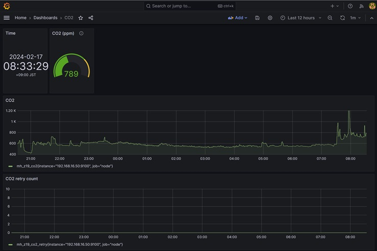
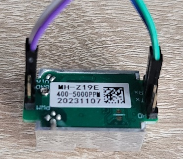

# raspi-co2-exporter
## 概要
ラズパイにCO2センサー mh_z19 で二酸化炭素を測定し、node-exporter でデータ取得し、prometheusでグラフ化する。  
  
  
### ラズパイ設定
#### シリアル設定
rootで作業
```
sudo su -
raspi-config
```
```hl_lines="7"
3 Interface Options

　I1 SSH         Enable/disable remote command line access using SSH
  I2 VNC         Enable/disable graphical remote desktop access
  I3 SPI         Enable/disable automatic loading of SPI kernel module
  I4 I2C         Enable/disable automatic loading of I2C kernel module
☆I5 Serial Port Enable/disable shell messages on the serial connection
  I6 1-Wire      Enable/disable one-wire interface
  I7 Remote GPIO Enable/disable remote access to GPIO pins
```
Would you like a login shell to be accessible over serial? で「いいえ」を選択する
Would you like the serial port hardware to be enabled? で「はい」を選択する

#### 再起動
```
reboot
```

#### pip install
```
sudo su -
apt update
apt upgrade
apt install python3-pip
pip3 install --break-system-packages --user mh_z19
python -m mh_z19
```
### CO2センサー mh_z19接続


#### 二酸化炭素がとれる
```
root@raspberrypi:~# python -m mh_z19
{"co2": 593}
root@raspberrypi:~#
```
#### 温度もとれるっぽい
```
root@raspberrypi:~# python -m mh_z19 --all
{"co2": 402, "temperature": 26, "TT": 66, "SS": 0, "UhUl": 13568}
root@raspberrypi:~#
```

### node-exporter インストール
#### text collect を使うので prometheus-node-exporter-collectors を apt install
```
apt install prometheus-node-exporter-collectors
```
#### node-exporter で読み込むテキストデータの場所
```
ls -l /var/lib/prometheus/node-exporter/
```

#### 動作確認
```
chmod 755 collect-co2.sh
./collect-co2.sh
```
#### 以下に保存されていることを確認
```
ls -l /var/lib/prometheus/node-exporter/
cat /var/lib/prometheus/node-exporter/mh_z19.prom
```
出力例
```
mh_z19_co2 713
mh_z19_co2_retry 0
```

#### crontab 
```
crontab -e
```
追加する
```
### raspi-co2-exporter ###
* * * * * /root/collect-co2.sh
```

### prometheus 設定
#### prometheus.yaml に追記する
```
  - job_name: node
    # If prometheus-node-exporter is installed, grab stats about the local
    # machine by default.
    static_configs:
    - targets:
      - localhost:9100
      - 192.168.0.50:9100 ★
```
### grafana 設定
#### grafana-co2.json をインポートする

